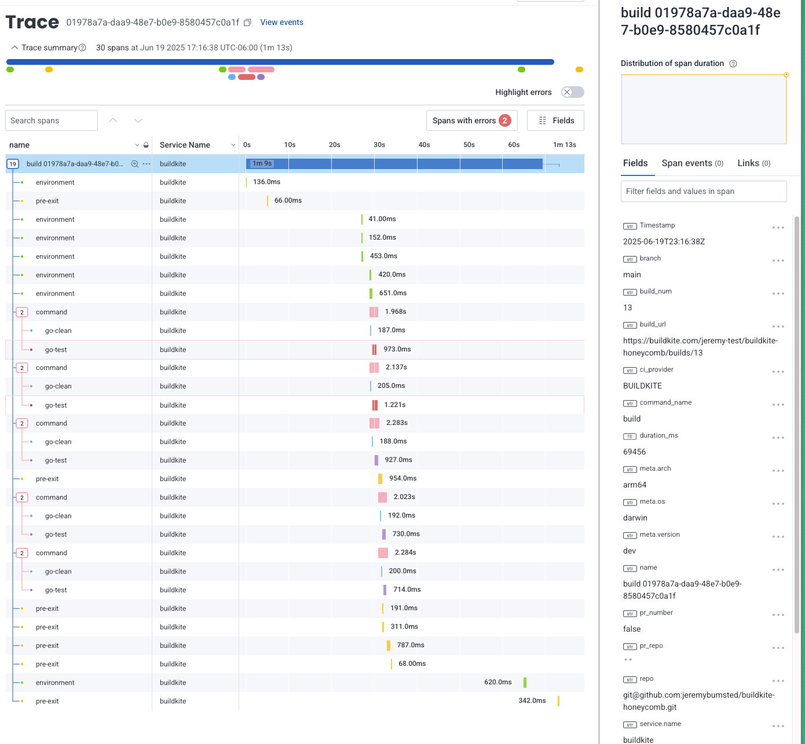

# buildkite-honeycomb
An example repository to show how you might use Honeycomb's Buildevents and Buildkite Markers in a Buildkite pipeline.

## Setup
Fork the repository, then click the button below to create a new Pipeline.
[](https://buildkite.com/new)

Further setup instructions are below for each of the tools used in this repository.

### Honeycomb Buildevents
The first set of tests (`buildevents-pipeline.yml`) uses [Honeycomb Buildevents](https://github.com/honeycombio/buildevents).

Configure your pipeline steps to run:
```yaml
steps:
  - label: ":pipeline:"
      command: "buildkite-agent pipeline upload .buildkite/buildevents-pipeline.yml"
      env:
        START_OF_BUILD: "true"
```


In your agent's environment hook (the location depends on how you have [installed the agent](https://buildkite.com/docs/agent/v3/installation)), set up the Honeycomb API key and dataset name, as well as a few other variables to capture the build times:

`~/.buildkite-agent/hooks/environment`
```bash
#!/bin/bash
if [[ "${START_OF_BUILD:-}" == "true" ]]; then
  export BUILD_START=$(date +%s)
fi

export STEP_START=$(date +%s)
export STEP_SPAN_ID="${BUILDKITE_JOB_ID}-environment"
...
export BUILDEVENT_APIKEY=your_api_key_here
export BUILDEVENT_DATASET=buildkite
export BUILDEVENT_APIHOST="https://api.honeycomb.io/"
export BUILDEVENT_CIPROVIDER="BUILDKITE"

# This is needed to capture the span for the environment hook
buildevents step $BUILDKITE_BUILD_ID $STEP_SPAN_ID $STEP_START environment
```
For any hooks, you'll need to configure these variables:
```bash
export STEP_START=$(date +%s)
export STEP_SPAN_ID="${BUILDKITE_JOB_ID}-hook-name" # recommended to use the hook name & job ID to identify the span in Honeycomb

# run this command at the end of your hook to capture the span:
buildevents step $BUILDKITE_BUILD_ID $STEP_SPAN_ID $STEP_START hook-name
```
Once the pipeline runs, you'll see an annotation that will link you to the trace in Honeycomb, it should look something like this:


### Honeymarker Buildkite Plugin
The second set (`markers-pipeline.yml`) uses the [Honeymarker Buildkite Plugin](https://github.com/tendnz/honeymarker-buildkite-plugin).

Configure your Pipeline steps to run:
```yaml
  - label: ":pipeline: Honeymarker plugin"
    command: "buildkite-agent pipeline upload .buildkite/markers-pipeline.yml"
```
